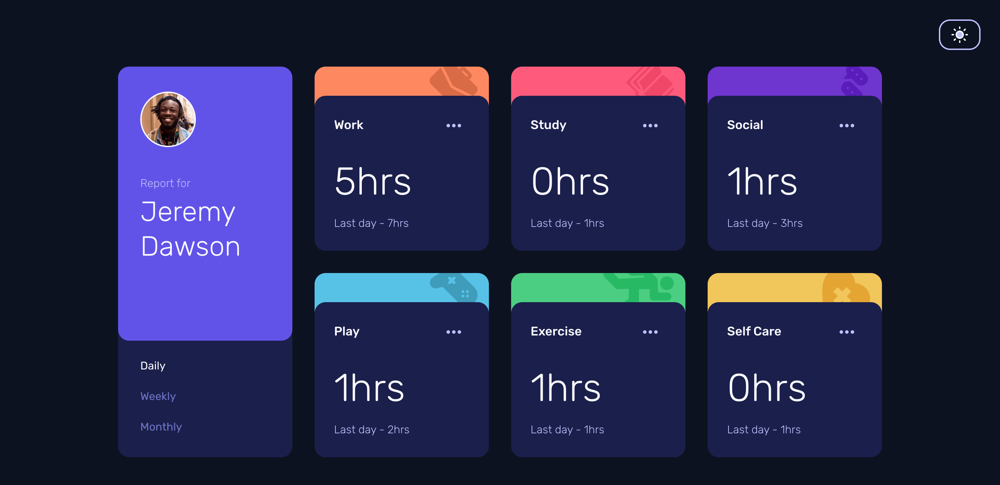
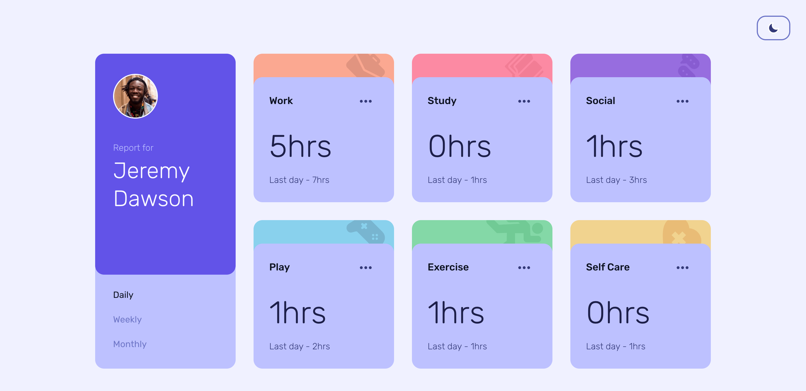

# Frontend Mentor - Time tracking dashboard solution

This is a solution to the [Time tracking dashboard challenge on Frontend Mentor](https://www.frontendmentor.io/challenges/time-tracking-dashboard-UIQ7167Jw). Frontend Mentor challenges help you improve your coding skills by building realistic projects. 

## Table of contents

- [Overview](#overview)
  - [The challenge](#the-challenge)
  - [Screenshot](#screenshot)
  - [Links](#links)
- [My process](#my-process)
  - [Built with](#built-with)
  - [What I learned](#what-i-learned)
  - [Continued development](#continued-development)
  - [Useful resources](#useful-resources)
- [Author](#author)

## Overview

### The challenge

Users should be able to:

- View the optimal layout for the site depending on their device's screen size
- See hover states for all interactive elements on the page
- Switch between viewing Daily, Weekly, and Monthly stats

Extended requirements:

- User should be able to switch between Dark and Light theme mode
- UI theme should be initialized based on user's system preferences
- User should be able to reset current streak on selected period
- User should be able to reset previous streak on selected period
- User should be able to reset all streak on selected period

### Screenshot

Dark theme 

Light theme 

### Links

- Live Site URL: [https://revuwem.github.io/time-tracking-dashboard/](https://revuwem.github.io/time-tracking-dashboard/)
- Solution URL: [https://github.com/revuwem/time-tracking-dashboard](https://github.com/revuwem/time-tracking-dashboard)

## My process

### Built with

- [Vite](https://vitejs.dev/) - build tool
- [React](https://reactjs.org/) - components
- [Typescript](https://www.typescriptlang.org/) - types
- [TailwindCSS](https://tailwindcss.com/) - styles
- [Redux Toolkit](https://redux-toolkit.js.org/) - state management
- [usehook-ts](https://usehooks-ts.com/) - hooks
- Desktop-first workflow

### What I learned

What I learned:

- how to implement React [dot notation pattern](https://revuwem.github.io/time-tracking-dashboard/) for reusable components 
- how to use Redux Toolkit to implement state management
- practice Typescript
- how to implement dark/light mode switch using React and TailwindCSS
- how to implement custom animations using TailwindCSS
- how to implement styles concerning about motion and appearance user settings
- how to implement delay in fetch requests

### Continued development

Concepts I am still not completely comfortable with or techniques I found useful that I want to refine and perfect:

  - reusable components best practices
  - accessibility best practices

### Useful resources

- [Redux Toolkit Quick Start](https://redux-toolkit.js.org/tutorials/quick-start) - Great official Redux Toolkit quick start tutorial
- [prefers-reduced-motion: Sometimes less movement is more](https://web.dev/prefers-reduced-motion/) - Great article about why reducing motion is important and how to implement it
- [How to Create Dark/Light Mode with React (Tailwind Styling)](https://dev.to/naomipham_/how-to-create-darklight-mode-with-react-and-tailwind-59e0) - Article which helped me to understand how to implement theme switch
- [Class detection in-depth](https://tailwindcss.com/docs/content-configuration#dynamic-class-names) - Tailwind official docs explaining how to work with dynamic classes

## Author

- Website - [revuwem](https://www.github.com/revuwem)
- Frontend Mentor - [@revuwem](https://www.frontendmentor.io/profile/revuwem)
